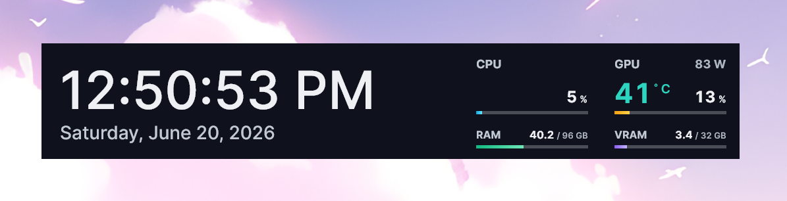
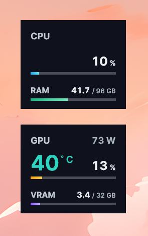
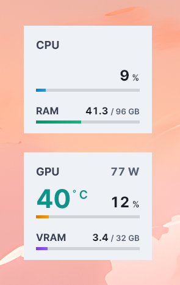
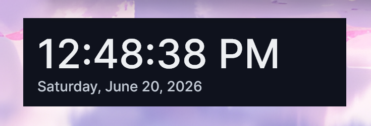
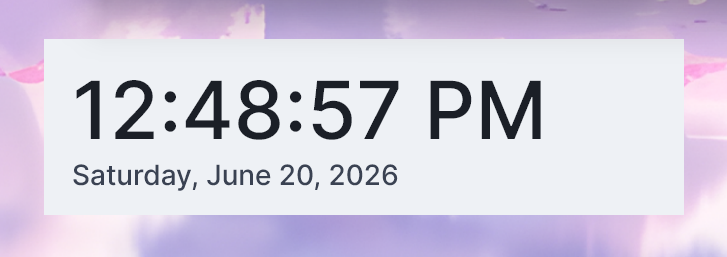
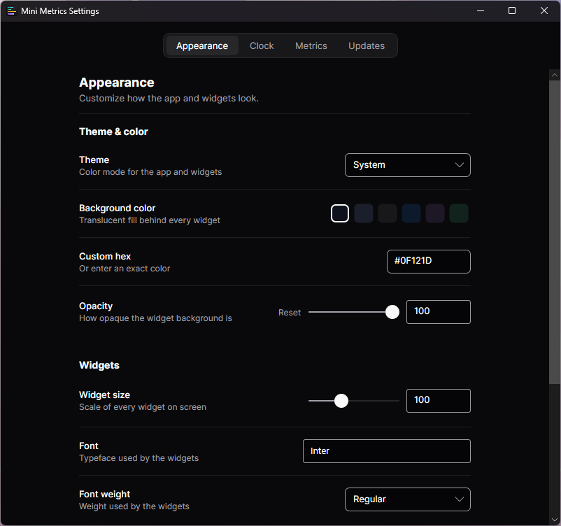

# MiniMetrics

A mini widget display for performance metrics that sits on your desktop. MiniMetrics keeps live CPU and GPU readouts and
a clock floating on your screen, always within view.

## Requirements

- Windows 10 or 11, 64-bit (x64)
- The default builds require the [.NET 10 Runtime](https://dotnet.microsoft.com/download/dotnet/10.0). The
  `selfcontained` builds bundle it and need nothing extra.
- For full hardware sensor access (for example CPU temperature and power), the app needs administrator rights and
  the [PawnIO](https://pawnio.eu/) driver. It asks for elevation only when you enable those metrics, points you to the
  driver if it is missing, and can start silently elevated at logon.
  See [Administrator rights and startup](docs/elevation-and-startup.md) for details.

## Features

- Floating CPU and GPU widgets with live readouts such as temperature, usage, power, and RAM/VRAM, powered
  by [LibreHardwareMonitor](https://github.com/LibreHardwareMonitor/LibreHardwareMonitor)
- Temperature color coding with thresholds, including a critical level for the GPU
- Light, dark, and system themes, with accent colors that follow the theme
- Compact layout toggle per widget (CPU, GPU, and clock) for a denser readout
- Date and time widget with time zone and locale selection, custom date/time format strings (with a separate format
  shown on hover), and left, center, or right text alignment
- Per-metric visibility toggles for CPU, RAM, GPU, and VRAM, so you show only what you care about
- Customizable background color (per theme) and opacity, with an always-on-top display
- Adjustable widget size, font family, and font weight, with the bundled Inter typeface as the default
- Per-option restore-to-default buttons so any single setting can be reset without touching the rest
- Edge snapping: widgets snap flush to screen edges and to each other
- Optional run at Windows startup
- System tray controls to show and hide widgets
- Remembers each widget's position and visibility between sessions
- Low footprint, with periodic memory trimming

## Download

Grab the newest build from the [latest release](https://github.com/blai30/MiniMetrics/releases/latest). Not sure which
to pick? Use **`MiniMetrics-Setup.exe`**, the recommended installer. Every build installs one-click (no wizard) and
updates itself in place; the choice is just two preferences:

- **Install or portable?** The installers (`-Setup.exe`) put MiniMetrics in your user profile with a Start Menu
  shortcut. The portable builds (`-Portable.zip`) run from wherever you unzip them. Both keep themselves up to date.
- **Do you have the [.NET 10 Runtime](https://dotnet.microsoft.com/download/dotnet/10.0)?** The default builds need it
  (they are smaller). If you do not have it, or are unsure, use a `selfcontained` build; it bundles the runtime and
  needs nothing else.

| Download                                 | Needs .NET 10 Runtime |
|------------------------------------------|-----------------------|
| `MiniMetrics-Setup.exe`                  | ✅                    |
| `MiniMetrics-Portable.zip`               | ✅                    |
| `MiniMetrics-Setup-selfcontained.exe`    | ❌ (bundled)          |
| `MiniMetrics-Portable-selfcontained.zip` | ❌ (bundled)          |

If you pick a default build without the .NET 10 Runtime installed, Windows tells you on first launch and links you to
the download; install it and reopen MiniMetrics. The `selfcontained` builds never need this.

The release also includes `.nupkg` and `releases.*.json` files, which the builds use to fetch their own updates; you do
not download them directly.

The builds and the installer are unsigned, so Windows SmartScreen may warn on first launch. Choose "More info" then "Run
anyway".

## Tech stack

- [Avalonia](https://avaloniaui.net/) 12 for the cross-platform UI toolkit
- [FluentAvalonia](https://github.com/amwx/FluentAvalonia) for the Fluent app theme, controls, and system accent
- C# on .NET 10
- [CommunityToolkit.Mvvm](https://learn.microsoft.com/dotnet/communitytoolkit/mvvm/) for MVVM
- [LibreHardwareMonitor](https://github.com/LibreHardwareMonitor/LibreHardwareMonitor) for hardware sensors
- [Velopack](https://velopack.io/) for packaging and in-app updates

## Screenshots

CPU and GPU widgets, shown in dark and light themes:

| Dark                                                                    | Light                                                                     |
|-------------------------------------------------------------------------|---------------------------------------------------------------------------|
|  |  |

Date and time widget:

| Dark                                                           | Light                                                            |
|----------------------------------------------------------------|------------------------------------------------------------------|
|  |  |

Settings window:

