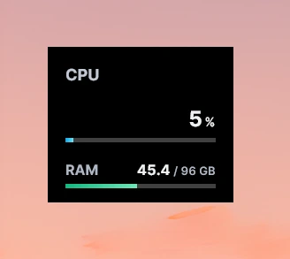
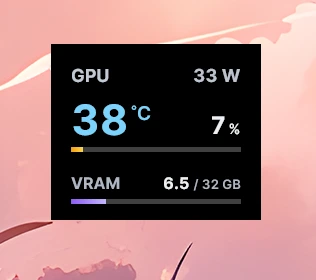
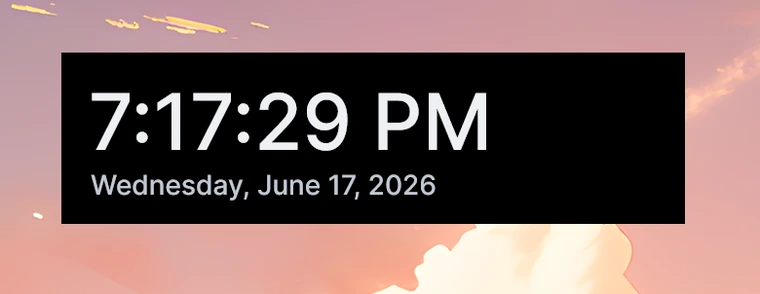
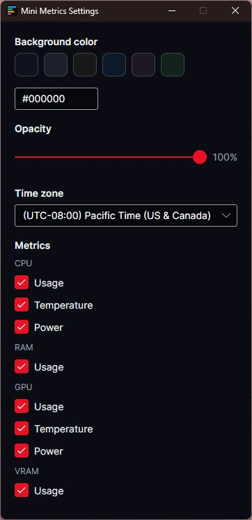

# MiniMetrics

A mini widget display for performance metrics that sits on your desktop. MiniMetrics keeps live CPU and GPU readouts and a clock floating on your screen, always within view.

## Requirements

- Windows 10 or 11, 64-bit (x64)
- The framework-dependent builds require the [.NET 10 Desktop Runtime](https://dotnet.microsoft.com/download/dotnet/10.0). The self-contained builds need nothing extra.
- For full hardware sensor access (for example CPU temperature and power), the app needs administrator rights and the [PawnIO](https://pawnio.eu/) driver. It asks for elevation only when you enable those metrics, points you to the driver if it is missing, and can start silently elevated at logon. See [Administrator rights and startup](docs/elevation-and-startup.md) for details.

## Features

- Floating CPU and GPU widgets with live readouts such as temperature, usage, power, and RAM/VRAM, powered by [LibreHardwareMonitor](https://github.com/LibreHardwareMonitor/LibreHardwareMonitor)
- Temperature color coding with thresholds, including a critical level for the GPU
- Date and time widget with timezone selection and a timezone offset shown on hover
- Per-metric visibility toggles for CPU, RAM, GPU, and VRAM, so you show only what you care about
- Customizable background color and opacity, with an always-on-top display
- Edge snapping: widgets snap flush to screen edges and to each other
- Optional run at Windows startup
- System tray controls to show and hide widgets
- Remembers each widget's position and visibility between sessions
- Low footprint, with periodic memory trimming

## Download

Grab the newest build from the [latest release](https://github.com/blai30/MiniMetrics/releases/latest). Not sure which to pick? Use **`MiniMetrics-sc-Setup.exe`**, the recommended installer. The other files cover specific preferences, explained below.

Two questions decide which one you want:

- **Should MiniMetrics keep itself up to date?** The installers (`-Setup.exe`) and the portable bundles (`-Portable.zip`) update themselves in place. The plain portable builds do not; they only notify you when a new version is out and link back here. So if you want portable *and* self-updating, pick a `-Portable.zip`.
- **Do you already have the [.NET 10 Desktop Runtime](https://dotnet.microsoft.com/download/dotnet/10.0)?** If so, the smaller default builds work. If not, or you are unsure, pick a `selfcontained` build; it bundles the runtime and needs nothing extra.

| Download | Self-updating | Needs .NET 10 | Pick this if |
| --- | --- | --- | --- |
| `MiniMetrics-sc-Setup.exe` | Yes | No | Recommended. Installs, updates in place, uninstalls cleanly. Bundles the runtime. |
| `MiniMetrics-fd-Setup.exe` | Yes | Yes | Same installer, smaller, when you already have the runtime. |
| `MiniMetrics-sc-Portable.zip` | Yes | No | Portable but still self-updating. Unzip and run, no install, stays current. |
| `MiniMetrics-fd-Portable.zip` | Yes | Yes | Same self-updating portable, smaller, when you have the runtime. |
| `MiniMetrics-v<version>-selfcontained.exe` | No | No | Plain portable. One loose file, nothing to install; you update it yourself. |
| `MiniMetrics-v<version>-selfcontained.zip` | No | No | Same as a folder. Unzip and run `MiniMetrics.exe`. |
| `MiniMetrics-v<version>.exe` | No | Yes | Plain portable, smallest single file, when you have the runtime. |
| `MiniMetrics-v<version>.zip` | No | Yes | Same as a folder. Unzip and run. |
| `MiniMetrics-v<version>-debug-symbols.zip` | - | - | Only needed for diagnosing crash reports. |

The release also includes `.nupkg` and `releases.*.json` / `assets.*.json` files. The self-updating builds use those to fetch updates; you do not download them directly.

The builds and the installer are unsigned, so Windows SmartScreen may warn on first launch. Choose "More info" then "Run anyway".

## Tech stack

- [Avalonia](https://avaloniaui.net/) 12 for the cross-platform UI toolkit
- C# on .NET 10
- [CommunityToolkit.Mvvm](https://learn.microsoft.com/dotnet/communitytoolkit/mvvm/) for MVVM
- [LibreHardwareMonitor](https://github.com/LibreHardwareMonitor/LibreHardwareMonitor) for hardware sensors

## Screenshots

CPU and GPU widgets:

| CPU | GPU |
| --- | --- |
|  |  |

Clock widget:

Settings, with background color, opacity, time zone, and per-metric visibility:

